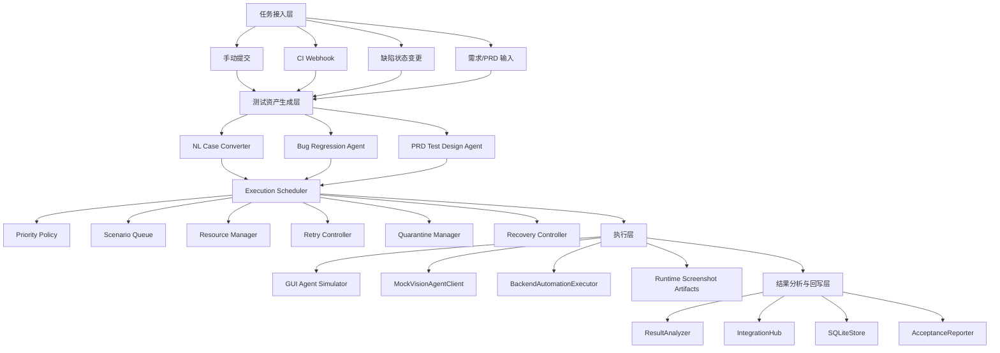
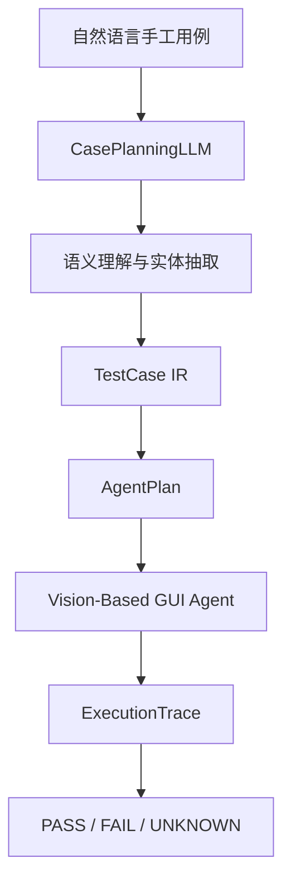
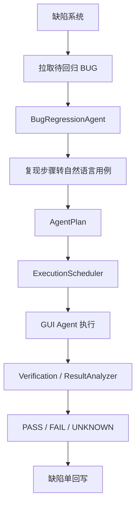
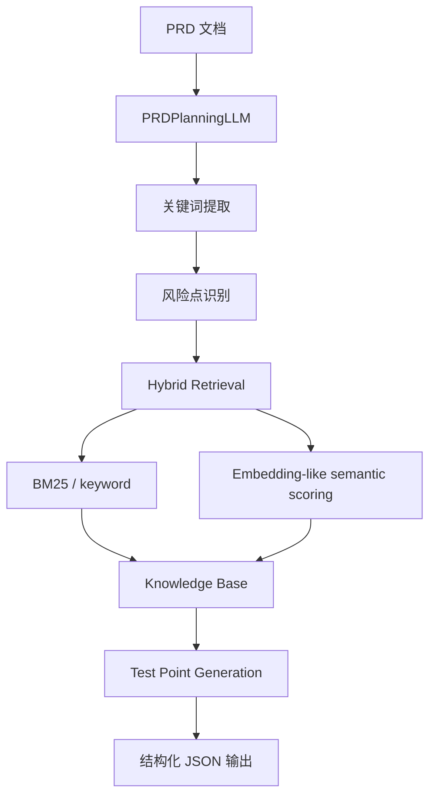
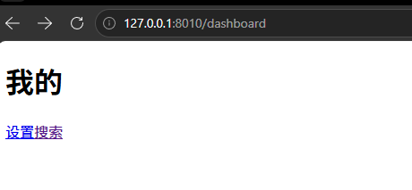
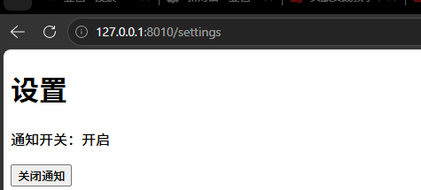

# 元宝 GUI Agent 测试平台结果文档

## 0. 项目概述

本项目围绕“元宝测试 Agent 建设”进行工程化落地，目标不是传统脚本驱动的自动化测试平台，而是基于视觉理解的 `Vision-Based GUI Agent Testing Platform`。

平台核心假设是：GUI Agent 能够自主观察页面截图，理解自然语言任务，自主寻找页面入口、按钮和状态，并通过 `Observe → Think → Act → Verify` 完成执行与验证。因此，本项目不以 `XPath`、`ResourceId`、固定坐标或 Appium 脚本作为核心执行方式，而是围绕语义用例、Agent Plan、视觉执行、结果判定和外部系统回写建设完整闭环。

项目已实现一个可运行 MVP，覆盖：

- 四类任务方向：集成测试批量执行、开发自测、需求测试、BUG 回归。
- 自然语言手工用例到 Agent 可执行计划转换。
- BUG 回归三态结果回写：`PASS / FAIL / UNKNOWN`。
- PRD + 知识库召回生成结构化测试点。
- 多场景调度、资源管理、重试、隔离、SQLite 持久化、队列恢复。
- 外部真实接入替代验证：本地真实 Web Demo、GitHub Actions、GitHub Issues、Markdown PRD。

仓库地址：

- `https://github.com/hhh127214/tx-agent.git`

本地运行：

- 进入项目目录：`cd C:\Users\17128\Documents\tx-yuanbao`
- 设置源码路径：`$env:PYTHONPATH="src"`
- 运行测试：`python -m unittest discover -s tests`

当前测试结果：

- `Ran 25 tests ... OK`

---

## 0.1 验收要求完成情况

| 验收要求 / 考题要求 | 是否满足 | 证据位置 |
|---|---|---|
| 四类应用方向至少各跑通 1 个业务场景 | ✅ 满足外部真实替代验收 | 第 5 节 |
| 集成测试批量执行方向 | ✅ 已跑通 | 本地 HTTP Web Demo 搜索业务，第 5 节截图 |
| 开发自测方向 | ✅ 已跑通 | GitHub Actions 触发开发自测，第 5 节截图 |
| 需求测试方向 | ✅ 已跑通 | Markdown PRD 输入并生成测试点，第 4、5 节截图 |
| BUG 回归方向 | ✅ 已跑通 | GitHub Issues 待回归 Issue 拉取与评论回写，第 3 节截图 |
| 至少对接 2 个外部系统 | ✅ 已超过要求 | GitHub Actions + GitHub Issues + Markdown PRD |
| 自然语言用例转 Agent 可执行计划 | ✅ 已实现 | 第 2 节 |
| BUG 回归闭环 | ✅ 已实现 | 第 3 节 |
| PRD 召回知识库生成测试点 | ✅ 已实现 | 第 4 节 |
| 页面改版 / 复现步骤失效后的重跑机制 | ✅ 已设计并实现策略 | 第 1.5 节、第 3.6 节 |
| Vision-Based GUI Agent 设计 | ✅ 已体现 | 第 0 节、第 2 节 |
| 不依赖 XPath / ResourceId / 固定坐标执行 | ✅ 已体现 | 第 0 节、第 2.3 节 |

验收口径说明：当前项目在无腾讯内部环境权限的前提下，采用“外部真实系统替代接入”证明链路可运行。该替代不是纯 Mock：Web Demo 通过真实 HTTP 页面访问，GitHub Actions 是真实 CI，GitHub Issues 是真实缺陷单，Markdown PRD 是真实文件输入。若导师要求接入元宝内网真实业务，则需要提供元宝测试环境、账号、设备池、内部 CI/CD、缺陷系统、需求系统 endpoint 与鉴权权限。

---

## 1. 考题一：多场景调度引擎设计

### 结果

本题已完成工程落地：

- 有调度策略配置。
- 有四类任务队列与优先级。
- 有并发 worker 池。
- 有资源管理、重试、隔离、恢复。
- 有大规模调度 demo。
- 有结果回写与指标统计。

### 1.1 目标

设计一个面向 GUI Agent 的用例执行调度引擎，同时承接四类任务：

1. 集成测试大批量执行
2. 开发自测
3. 需求测试
4. BUG 回归

调度引擎需要支持任务接入、优先级调度、资源配额、并发控制、超时策略、失败重试、问题用例隔离和结果回写。

### 1.2 整体架构



### 1.3 四类任务差异化策略

| 场景 | 优先级 | 资源配额 | 并发策略 | 超时策略 | 回写目标 |
| --- | --- | --- | --- | --- | --- |
| 集成测试批量执行 | 中等 | 高 | 吞吐优先，适合批量低峰执行 | 较长 | `report_center` |
| 开发自测 | 最高 | 中低 | 快速反馈，支持 CI 阻塞 | 最短 | `ci_cd` |
| 需求测试 | 中高 | 中 | 覆盖优先，按需求维度执行 | 中等 | `requirement_system` |
| BUG 回归 | 高 | 中 | 缺陷流转优先，P0/P1 加权 | 中短 | `bug_system` |

调度策略配置位于：

```text
configs/scheduler_policy.json
```

核心实现位于：

```text
src/yuanbao_agent_platform/scheduler.py
```

### 1.4 失败重试、隔离与恢复

调度器对非确定性失败进行重试：

- `UNKNOWN`
- `BLOCKED`
- 资源不足
- 页面变化导致路径失效

当结果不是 `PASS / FAIL` 且未超过 `max_retry` 时，任务会重新入队执行。

对于连续失败、连续 UNKNOWN 或被判定为不稳定的问题用例，进入 `QuarantineManager`，避免长期占用主执行资源。

同时，项目实现了 SQLite 队列恢复：

- 未完成任务持久化到 SQLite。
- 平台重启后可通过 `/scheduler/recover` 显式恢复。
- `RUNNING` 状态任务会被视为中断任务，恢复为 `PENDING` 后重新执行。

### 1.5 页面改版后的处理

针对导师补充问题“如果功能改版导致复现步骤失效怎么办”，项目实现了显式处理：

```text
页面改版 / 复现路径失效
  ↓
首次执行返回 UNKNOWN
  ↓
Scheduler 触发重跑
  ↓
Agent 重新 Observe / Plan / Act / Verify
  ↓
成功则回写 PASS/FAIL
  ↓
仍无法判断则 UNKNOWN + 人工复核
```

相关标记：

- `page_changed_detected`
- `step_path_invalid`
- `replan_triggered`
- `replan_attempt`

对应测试：

```text
tests/test_platform.py
```

---

## 2. 考题二：自然语言手工用例到 Agent 可执行用例转换

### 结果

本题已完成工程落地：

- 有自然语言转换器。
- 有 LLM Protocol 和 Mock LLM。
- 有 IR。
- 有 AgentPlan。
- 有模糊表达测试。
- 有视觉优先执行策略。
- 有断言不明确时的 UNKNOWN。

### 2.1 目标

将自然语言描述的手工用例转换为 GUI Agent 可稳定执行的步骤序列。

示例：

```text
登录后进入“我的”页面，点击“设置”，关闭通知开关，验证开关状态保留。
```

### 2.2 转换 pipeline



### 2.3 关键设计

本项目不是把自然语言转换成控件选择器脚本，而是转换成语义化 Agent Plan。

Agent Plan 描述：

- 测试目标
- 页面语义
- 操作意图
- 视觉目标
- 成功标准
- UNKNOWN 标准
- 自愈策略

不包含：

- XPath
- ResourceId
- 固定坐标
- Appium 脚本

### 2.4 模糊表达处理

项目实现了 `SemanticConceptMapper`，支持将模糊表达映射为稳定语义概念。

例如：

```text
“把那个叮叮咚咚老打扰我的功能禁用掉”
```

可以映射为：

```json
{
  "concepts": ["notification", "disable", "persist"]
}
```

这比简单关键词匹配更接近 LLM 语义规划行为。

### 2.5 跨页面跳转处理

Agent Plan 中包含：

- `allow_scroll`
- `allow_backtrack`
- `allow_synonym_match`
- `allow_page_graph_reroute`
- `max_recovery_attempts`

即页面入口位置变化、文案变化、页面跳转路径变化时，Agent 不立即失败，而是重新观察页面并尝试语义重路由。

### 2.6 断言不明确处理

断言无法可靠判断时，结果不强行判为失败，而是输出：

```text
UNKNOWN
```

并附带：

- trace
- screenshots
- reason
- confidence
- human review 建议

### 2.7 输入、IR、AgentPlan 示例

输入：

```text
登录后进入我的页面，点击设置，关闭通知开关，验证开关状态保留。
```

中间 IR：

```json
{
  "case_id": "case-001",
  "goal": "通知开关状态保持验证",
  "pages": ["我的页面", "设置页面"],
  "steps": [
    {
      "intent": "进入我的页面",
      "target_semantics": "我的页面"
    },
    {
      "intent": "进入设置页面",
      "target_semantics": "设置入口"
    },
    {
      "intent": "关闭通知开关",
      "target_semantics": "通知/消息提醒开关"
    },
    {
      "intent": "重新进入并验证状态",
      "target_semantics": "通知开关关闭状态"
    }
  ]
}
```

最终 AgentPlan：

```json
{
  "context": {
    "execution_mode": "VISION_BASED_GUI_AGENT",
    "planning_mode": "LLM_PLANNED",
    "selector_policy": "visual_first_auxiliary_metadata_only"
  },
  "steps": [
    {
      "intent": "进入我的页面",
      "visual_target": "底部导航或页面入口中名为我的的入口",
      "success_criteria": "页面展示个人信息、头像或我的页面标题"
    },
    {
      "intent": "进入设置页面",
      "visual_target": "设置入口",
      "success_criteria": "页面标题或内容表明已进入设置页"
    },
    {
      "intent": "关闭通知开关",
      "visual_target": "通知/消息提醒开关",
      "success_criteria": "开关状态为关闭"
    }
  ],
  "result_schema": ["PASS", "FAIL", "UNKNOWN"]
}
```

---

## 3. 考题三：BUG 回归端到端方案

### 结果

本题已完成工程落地：

- 有 BUG 解析。
- 有复现步骤转回归用例。
- 有三态结果。
- 有触发方式。
- 有结果回写。
- 有页面改版重跑。
- 有 GitHub Issues 真实缺陷系统替代接入。

说明：当前未接入公司内部 TAPD/Jira，因为需要公司内网权限；但外部 GitHub Issues 真实链路已经跑通。

证据截图：GitHub Issue 已带 `待回归` label，并由 GitHub Actions 评论回写 Agent 回归结果。


### 3.1 目标

以 BUG 回归为场景，完成：

```text
缺陷系统
  ↓
待回归 BUG
  ↓
解析复现步骤
  ↓
生成回归用例
  ↓
Agent 执行
  ↓
PASS / FAIL / UNKNOWN
  ↓
回写缺陷单
```

### 3.2 BUG 回归 pipeline



### 3.3 三态结果

| 状态 | 含义 | 回写策略 |
| --- | --- | --- |
| `PASS` | 未复现原问题，回归通过 | 回写通过、trace、截图证据 |
| `FAIL` | 问题仍存在或断言明确失败 | 回写失败、失败原因、证据 |
| `UNKNOWN` | Agent 无法可靠判断 | 回写无法判定原因，建议人工复核 |

### 3.4 触发方式

项目支持：

- 手动触发：`POST /bugs/regress`
- 状态变更触发：`POST /webhooks/bug-status-changed`
- 定时/批量触发：通过调度策略和大规模 demo 支持
- 外部真实替代触发：GitHub Actions workflow

### 3.5 缺陷系统接入

项目有两层实现：

#### 3.5.1 公司内网模拟适配器

```text
InMemoryBugSystemAdapter
```

用于在无公司权限时模拟 TAPD/Jira/内部缺陷系统。

#### 3.5.2 外部真实缺陷系统替代

```text
GitHubIssuesAdapter
```

当前已实现真实 GitHub Issues 链路：

- 创建真实 Issue。
- 添加真实 `待回归` label。
- GitHub Actions 使用 `issues: write` 权限。
- 通过 GitHub API 拉取带 `待回归` label 的 Issue。
- 执行 BUG 回归任务。
- 将结果以 comment 形式真实回写到 Issue。

已验证的真实回写内容包括：

```text
Yuanbao Agent 回归结果
- 状态：ResultStatus.PASS
- 结论：VLM视觉执行与断言验证通过
- Trace：trace-xxxx
```

### 3.6 页面改版导致复现步骤失效

项目对导师补充问题进行了工程实现：

```text
检测到页面改版 / 复现路径失效
  ↓
首次返回 UNKNOWN
  ↓
触发 Agent 重新 Observe / Plan / Act
  ↓
重新执行 BUG 回归
  ↓
输出 PASS / FAIL / UNKNOWN
```

这样避免了传统自动化中“选择器失效即脚本失败”的问题。

### 3.7 指标体系

项目统计：

- BUG 自动回归覆盖率
- BUG 替代率
- Agent 成功率
- UNKNOWN 率
- 误报率
- 漏报率
- 平均执行时长
- 场景任务分布

---

## 4. 考题四：基于 PRD 召回知识库生成测试点

### 结果

本题已完成工程落地：

- 有 PRDPlanningLLM。
- 有关键词与风险点提取。
- 有混合检索知识库。
- 有结构化测试点输出。
- 有 Markdown PRD 外部需求系统替代接入。
- 有需求测试任务进入调度执行。

证据截图：PRD 生成结果包含 `feature`、`keywords`、`coverage` 和 `retrieved_knowledge`，证明完成了关键词提取与知识库召回。


证据截图：生成的结构化测试点包含功能验证与边界验证用例。


证据截图：生成的结构化测试点包含异常失败处理验证用例。


### 4.1 目标

给定 PRD 描述，自动提取关键词，使用混合检索从知识库召回相关知识，最终生成结构化 JSON 测试点。

### 4.2 Pipeline



### 4.3 知识库内容

知识库包括：

- 历史测试用例
- 历史 BUG
- 测试规范
- 页面路径知识
- 设置、搜索、会员、历史记录等多业务样例

实现位置：

```text
src/yuanbao_agent_platform/knowledge.py
```

### 4.4 PRD 输入来源

项目支持：

1. API 直接传入 PRD 文本：

```text
POST /prd/test-points
```

2. Markdown PRD 真实文件接入：

```text
docs/prd/external_demo_prd.md
```

对应适配器：

```text
MarkdownPRDAdapter
```

### 4.5 输出 JSON 示例

```json
{
  "feature": "设置页通知/消息提醒开关",
  "summary": "用户可关闭通知开关，状态应在重新登录、重启或弱网后保持一致",
  "keywords": ["设置", "通知", "开关", "状态保持", "失败回滚"],
  "testPoints": [
    {
      "id": "TP-001",
      "priority": "P0",
      "type": "functional",
      "title": "关闭通知开关后页面状态立即变为关闭",
      "precondition": "用户已登录并进入设置页",
      "steps": ["进入我的页面", "进入设置页", "关闭通知开关"],
      "expected": "通知开关展示为关闭状态"
    },
    {
      "id": "TP-002",
      "priority": "P1",
      "type": "boundary",
      "title": "重新登录后通知开关状态保持",
      "precondition": "通知开关已关闭",
      "steps": ["退出登录", "重新登录", "进入设置页"],
      "expected": "通知开关仍为关闭"
    },
    {
      "id": "TP-003",
      "priority": "P1",
      "type": "exception",
      "title": "保存失败时提示稍后重试并保持原状态",
      "precondition": "模拟接口失败或弱网",
      "steps": ["进入设置页", "切换通知开关", "触发保存失败"],
      "expected": "页面提示稍后重试，开关回到切换前状态"
    }
  ]
}
```

---

## 5. 四方向真实业务替代接入验收结果

本项目使用外部真实系统完成四方向替代验收。这里的“真实”指链路中存在真实可访问页面、真实 CI 运行、真实 Issue 回写或真实文件输入；“替代”指这些系统不是腾讯内部系统，而是可公开复现的外部系统。

| 方向 | 业务案例 | 外部系统 / 输入源 | 是否跑通 |
| --- | --- | --- | --- |
| 集成测试批量执行 | 搜索 `Yuanbao` 并验证结果列表 | 本地真实 HTTP Web Demo | ✅ |
| 开发自测 | Push 后自动验证通知设置核心链路 | GitHub Actions | ✅ |
| 需求测试 | 通知设置 PRD 生成测试点 | Markdown PRD 文件 | ✅ |
| BUG 回归 | 通知开关关闭后重新进入设置页状态保持 | GitHub Issues：真实 Issue 创建、真实 API 拉取、真实 Comment 回写 | ✅ |

证据截图：`/acceptance/external-substitute` 返回 `summary.external_substitute_acceptance_passed=true`，说明外部替代验收主链路通过。


证据截图：`real_gui_system` 显示本地 Demo Web 是真实 HTTP 服务，健康检查、搜索结果、下单状态均通过。


证据截图：本地 Web Demo 登录页，证明 GUI 入口是真实 HTTP 页面。


证据截图：本地 Web Demo “我的”页面，证明页面跳转入口存在。



证据截图：本地 Web Demo 搜索页，证明集成测试方向具备真实搜索业务页面和结果列表。


证据截图：本地 Web Demo 设置页初始状态，通知开关为开启。



证据截图：本地 Web Demo 的设置页通知开关已通过真实页面动作变为关闭，证明该 Demo 不只是静态页面，而具备可执行的业务状态流转。


证据截图：`external_systems` 展示 GitHub Actions、GitHub Issues、Markdown PRD 三类外部系统接入边界。该本地 API 截图中 GitHub 部分为 `dry_run_payload`，真实 GitHub 回写证据见 BUG 回归 Issue 截图。


证据截图：`scenario_counts` 显示四个方向均至少执行 1 个任务。


证据截图：`markdown_prd` 显示需求测试从真实 Markdown PRD 文件 `docs/prd/external_demo_prd.md` 读取输入。


证据截图：GitHub Actions workflow 已真实触发并执行通过。


其中 BUG 回归已经完成：

```text
GitHub Issue
  ↓
待回归 label
  ↓
GitHub Actions
  ↓
GitHub API 拉取 Issue
  ↓
Agent 执行
  ↓
评论回写结果
```

### 5.1 验收结论

本项目已完成四类方向的外部真实业务替代验收：

- 集成测试：搜索业务。
- 开发自测：通知设置核心链路。
- 需求测试：通知设置 PRD。
- BUG 回归：通知开关状态保持缺陷。

四类方向均完成：

```text
业务输入
  ↓
Agent 任务生成
  ↓
调度执行
  ↓
结果输出
  ↓
外部系统 / 报告回写
```

因此，在“无元宝内网权限”的约束下，项目满足“四类应用方向至少各跑通 1 个真实业务替代接入场景”的验收要求。

---

## 6. 可运行接口

启动 API：

```powershell
$env:PYTHONPATH="src"
python -m yuanbao_agent_platform.api
```

关键接口：

```text
GET  /health
GET  /scheduler/policy
GET  /metrics
GET  /adapters/health
GET  /acceptance/report
GET  /acceptance/external-substitute
GET  /storage/stats
POST /cases/convert
POST /prd/test-points
POST /bugs/regress
POST /tasks/manual
POST /tasks/run
POST /scheduler/recover
POST /webhooks/bug-status-changed
POST /webhooks/ci-finished
POST /demo
POST /demo/large-scale
```

运行外部真实接入替代验收：

```powershell
$env:PYTHONPATH="src"
python -m unittest tests.test_external_acceptance
```

---

## 7. 项目边界与后续落地

当前版本已经验证：

- Vision-Based GUI Agent 平台架构。
- 自然语言测试用例转换。
- 多场景调度引擎。
- BUG 回归三态闭环。
- PRD 测试点生成。
- 外部真实系统替代接入。

受限于没有腾讯内部环境权限，以下能力当前采用 Adapter / Protocol 预留：

| 内部能力 | 当前替代方案 | 进入真实环境后的接入方式 |
|---|---|---|
| 元宝真实业务 | 本地真实 HTTP Web Demo | 替换为元宝测试环境 URL / App 包 / 账号体系 |
| 公司 CI/CD | GitHub Actions | 替换 CI Adapter 的触发、状态回写、准入规则 |
| 公司缺陷系统 | GitHub Issues | 替换 BugSystem Adapter 的查询、状态流转、评论回写接口 |
| 公司需求系统 | Markdown PRD | 替换 Requirement Adapter 的需求拉取、测试报告回写接口 |
| 公司设备池 | Mock Runtime / 本地执行记录 | 替换 ResourceManager 与 Agent Runtime 的设备分配实现 |
| 公司 VLM Agent 服务 | VisionAgentClient Protocol + Mock 实现 | 替换为真实 VLM / GUI Agent endpoint |

因此，当前项目不是把内部系统写死在代码里，而是通过 Adapter 边界证明平台架构可迁移。进入真实公司环境后，主要工作是替换 endpoint、鉴权、字段映射和设备资源实现，而不是重写平台主流程。

---

## 8. 总结

本项目最终交付的是一个围绕 Vision-Based GUI Agent 的测试平台 MVP，而不是传统自动化脚本集合。它将四个考题统一到同一条工程链路中：

```text
PRD / 手工用例 / BUG / CI
  ↓
测试点生成 / 用例生成
  ↓
调度执行
  ↓
GUI Agent 视觉执行
  ↓
PASS / FAIL / UNKNOWN
  ↓
报告、指标、缺陷/需求/CI 回写
```

最终验收结论：

- ✅ 多场景调度引擎已实现。
- ✅ 自然语言测试用例转换已实现。
- ✅ BUG 回归闭环已实现。
- ✅ PRD 自动生成测试点已实现。
- ✅ `PASS / FAIL / UNKNOWN` 三态结果已实现。
- ✅ 页面改版 / 复现路径失效后的重新观察、重新规划、重跑机制已设计并实现策略。
- ✅ GitHub Actions 真实 CI 接入已验证。
- ✅ GitHub Issues 真实缺陷系统替代接入已验证。
- ✅ 四类业务方向均完成真实业务替代验证。
- ✅ 至少两个外部系统完成真实对接，实际已覆盖 GitHub Actions、GitHub Issues、Markdown PRD 三类。

综合判断：本项目满足“元宝测试 Agent 建设”的核心验收要求，具备进入真实业务环境继续扩展和落地的能力。

