# 元宝 GUI Agent 测试平台结果文档

## 0. 项目结果总览

本项目围绕“元宝测试 Agent 建设”完成了一个可运行 MVP。目标不是传统 `XPath / ResourceId / 坐标` 驱动的自动化测试平台，而是自然语言驱动的 **GUI Agent UI 自动化 + 后台接口自动化统一测试执行平台**：用户输入自然语言手工用例、PRD 或 BUG 复现步骤，平台内部转换为 IR / AgentPlan / API Case，再统一调度 GUI Agent 和 Backend API 自动化执行、验证和结果回写。

仓库地址：`https://github.com/hhh127214/tx-agent.git`

### 0.1 验收结果

| 验收项 | 最终结果 | 证据 |
|---|---|---|
| 考题一：多场景调度引擎 | 已实现四类任务调度、资源配额、并发、超时、重试、隔离 | 第 1 节 |
| 考题二：自然语言用例转 Agent 可执行用例 | 已实现 NL → IR → AgentPlan，不依赖 XPath / 坐标 | 第 2 节 |
| 考题三：BUG 回归端到端方案 | 已实现 Issue 拉取、任务生成、Agent 执行、三态回写 | 第 3 节 |
| 考题四：PRD 召回知识库生成测试点 | 已实现关键词提取、混合召回、结构化 JSON 测试点 | 第 4 节 |
| GUI + Backend 混合调度 | 已实现同一批次调度 `GUI_AGENT` 与 `BACKEND_AUTOMATION` | 第 1、5 节 |
| CI/CD 提测准入 gate | 已实现构建失败阻断、构建成功后执行 UI 冒烟 + API 冒烟 | 第 5、6 节 |
| 四类方向各跑通 1 个业务场景 | 已完成外部真实替代验收 | 第 5 节 |
| 至少对接 2 个外部系统 | 已对接 GitHub Actions、GitHub Issues、Markdown PRD | 第 5 节 |

说明：由于没有腾讯内部元宝环境、公司 CI/CD、缺陷系统、需求系统和设备池权限，本项目采用“外部真实系统替代接入”完成验证。该替代不是纯 Mock：本地 Web Demo 是真实 HTTP 页面，GitHub Actions 是真实 CI，GitHub Issues 是真实缺陷单，Markdown PRD 是真实文件输入。

---

## 1. 考题一结果：多场景调度引擎

### 1.1 实现步骤

1. 定义四类任务类型：`INTEGRATION_BATCH`、`DEV_SELF_TEST`、`REQUIREMENT_TEST`、`BUG_REGRESSION`。
2. 为每类任务配置优先级、资源配额、并发度、超时时间、重试次数。
3. 实现调度器：任务入队后按照优先级和资源策略分配执行资源。
4. 实现统一执行路由：`GUI_AGENT` 任务进入 GUI Agent Runtime，`BACKEND_AUTOMATION` 任务进入 Backend API Executor。
5. 实现失败处理：失败重试、超时释放资源、连续失败进入 quarantine 隔离。
6. 实现 SQLite 持久化：任务、结果、回写记录可落库，重启后可恢复未完成任务。
7. 实现结果回写：根据任务来源回写到报告中心、CI、需求系统或缺陷系统。

### 1.2 最终结果

| 任务类型 | 优先级 | 资源策略 | 并发策略 | 超时策略 | 回写目标 |
|---|---|---|---|---|---|
| BUG 回归 | 最高 | 保证资源 | 高并发优先执行 | 中等超时 | 缺陷系统 |
| 开发自测 | 高 | CI 专用资源 | 快速反馈 | 短超时 | CI/CD |
| 需求测试 | 中 | 按需求单分组 | 中等并发 | 中等超时 | 需求报告 |
| 集成测试批量 | 低 | 批量资源池 | 可大批量并发 | 长超时 | 测试报告 |

混合执行结果：

| 自动化类型 | 示例任务 | 执行资源 | 结果证据 |
|---|---|---|---|
| `GUI_AGENT` | 登录后关闭通知开关并验证状态保持 | device | `docs/evidence_mixed_automation.json` |
| `BACKEND_AUTOMATION` | 调用健康检查接口和下单接口并断言响应 | container | `docs/evidence_mixed_automation.json` |

混合调度证据文件：`docs/evidence_mixed_automation.json`，其中 `automation_type_counts` 同时包含 `GUI_AGENT` 和 `BACKEND_AUTOMATION`。

同一业务链路证据文件：`docs/evidence_business_trace.json`，展示“GUI 关闭通知开关 → Backend 查询通知状态 → 统一 PASS/FAIL 判断”的端到端 trace。

调度结果证据：四类方向均至少执行 1 个任务。

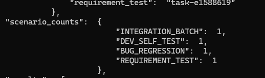

验收接口通过证据：


### 1.3 对题目要求的满足情况

| 题目要求 | 实现结果 |
|---|---|
| 任务接入层、调度层、执行层、结果回写层 | 已实现 API 接入、Scheduler、Agent Runtime、Result Writeback |
| 四类任务差异化处理 | 已按优先级、资源配额、并发度、超时策略区分 |
| 同时调度 GUI Agent 和后台自动化 | 已实现统一 Scheduler + ExecutionRouter，GUI 使用 device，Backend 使用 container |
| 失败重试 | 已实现 retry 策略 |
| 回滚 / 资源释放 | 任务结束或超时后释放 session 与资源 |
| 避免问题用例长期占用资源 | 已实现 quarantine 隔离策略 |

---

## 2. 考题二结果：自然语言用例转 Agent 可执行用例

### 2.1 实现步骤

1. 输入自然语言手工用例，例如：“登录后进入我的页面，点击设置，关闭通知开关，验证关闭状态保留。”
2. `Test Understanding Agent` 抽取测试目标、前置条件、动作、断言点。
3. `Plan Generation Agent` 将自然语言转换为中间表示 IR。
4. 根据 IR 生成 AgentPlan，交给 GUI Agent 执行。
5. GUI Agent 不接收 XPath、ResourceId 或固定坐标，只接收视觉目标和语义动作。
6. 对模糊表达进行语义归一，例如“消息提醒”“通知”“叮咚提醒”映射到通知开关能力。
7. 对跨页面跳转使用 Page Graph / 历史经验生成导航路径。
8. 对断言不明确的用例补全验证点，例如“状态保留”补为“关闭后重新进入页面仍为关闭”。

### 2.2 最终结果

已实现从自然语言到 Agent 可执行计划的转换链路：

`Natural Language → TestIntent → CaseIR → AgentPlan → GUI Agent`

示例结果：

| 阶段 | 内容 |
|---|---|
| 输入用例 | 登录后进入我的页面，点击设置，关闭通知开关，验证关闭状态保留 |
| 识别目标 | 验证通知开关关闭后状态持久化 |
| 执行步骤 | 登录 → 进入我的 → 进入设置 → 关闭通知 → 重新进入设置 |
| 断言点 | 通知开关仍为关闭 |
| Agent 输入 | 语义目标、页面意图、视觉验证点 |

IR 与步骤序列生成证据：

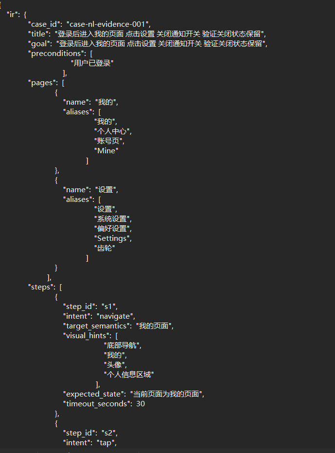

AgentPlan 生成证据：

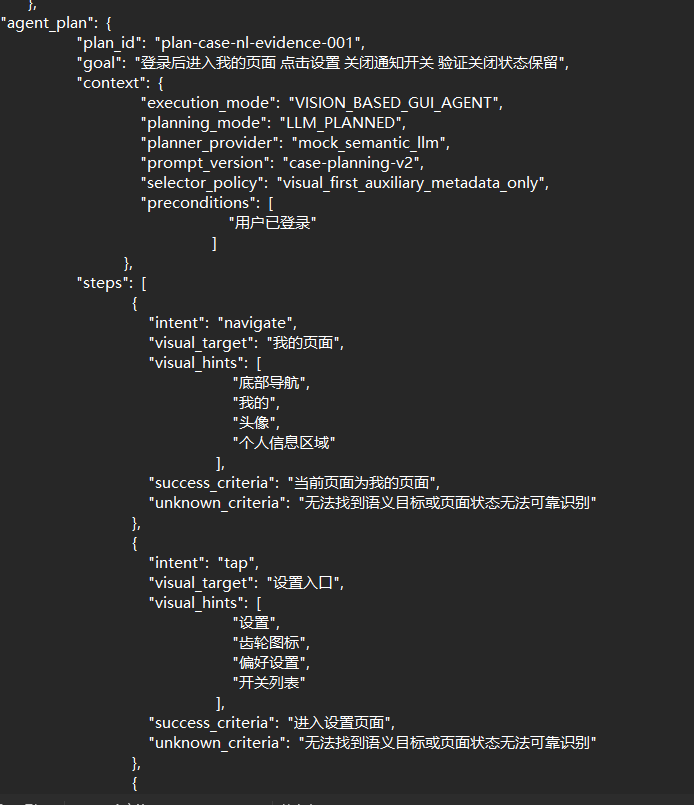

### 2.3 对题目要求的满足情况

| 题目要求 | 实现结果 |
|---|---|
| 自然语言转稳定步骤序列 | 已实现 NL → IR → AgentPlan |
| 处理模糊表达 | 已实现语义映射和澄清策略 |
| 处理跨页面跳转 | 已使用 Page Graph / 页面目标路径 |
| 处理断言不明确 | 已补全默认断言和 `UNKNOWN` 判定 |
| 端到端示例 | 已给出通知开关状态保持示例 |
| 不依赖 XPath / 坐标 | 已明确采用视觉目标和自然语言动作 |

---

## 3. 考题三结果：BUG 回归端到端方案

### 3.1 实现步骤

1. 从缺陷系统拉取待回归 BUG。当前真实替代实现使用 GitHub Issues。
2. 筛选带 `待回归` label 的 Issue。
3. 解析 Issue 标题、复现步骤、期望结果、实际结果。
4. 将 BUG 复现步骤转换为回归用例。
5. 将回归用例提交给调度器。
6. GUI Agent 执行回归任务并生成 trace。
7. Verification Agent 输出三态结果：`PASS / FAIL / UNKNOWN`。
8. 将回归结果评论回写到 GitHub Issue。

### 3.2 最终结果

已完成真实 GitHub Issues 回写闭环：

| 环节 | 结果 |
|---|---|
| 缺陷来源 | GitHub Issue #1 |
| 触发条件 | `待回归` label |
| 执行方式 | GitHub Actions 触发回归流程 |
| 执行结果 | `ResultStatus.PASS` |
| 回写方式 | GitHub Actions bot 评论回写 |
| Trace | 已生成 trace id |

GitHub Issue 回写证据：

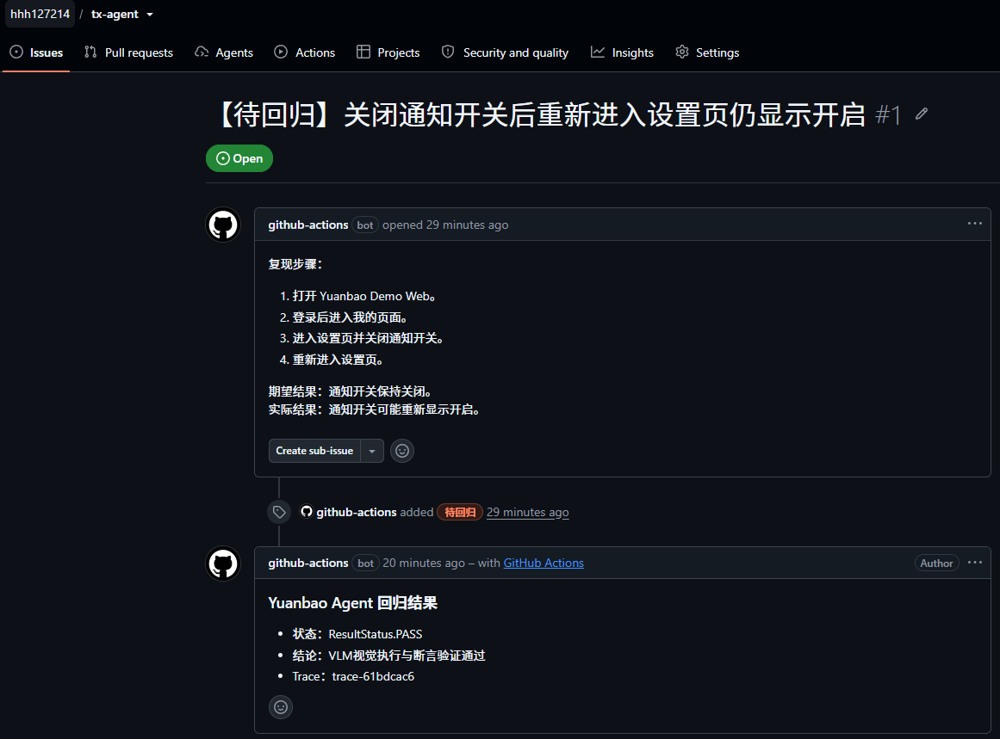

GitHub Actions 执行通过证据：

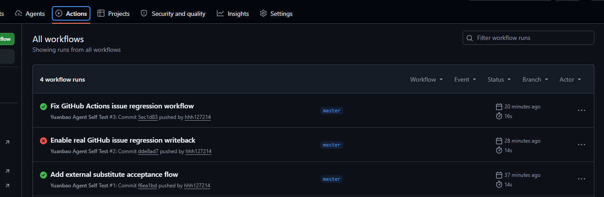

### 3.3 三态结果设计

| 状态 | 含义 | 回写策略 |
|---|---|---|
| `PASS` | 原 BUG 未复现，回归通过 | 回写通过、trace、关键证据 |
| `FAIL` | 原 BUG 仍存在或断言失败 | 回写失败原因、截图、trace |
| `UNKNOWN` | Agent 无法可靠判断 | 回写无法判定原因，建议人工复核 |

### 3.4 对题目要求的满足情况

| 题目要求 | 实现结果 |
|---|---|
| 从缺陷系统拉取 BUG | 已通过 GitHub Issues 真实替代实现 |
| 复现步骤转可执行用例 | 已实现 BUG → Regression Case → AgentPlan |
| 手动触发 | 支持 API 触发 |
| 定时触发 | 支持批量调度策略 |
| 状态变更触发 | 支持 webhook 触发；GitHub label 作为状态替代 |
| 回写缺陷单 | 已评论回写 GitHub Issue |
| 三态结果 | 已实现 `PASS / FAIL / UNKNOWN` |
| 有效性指标 | 已设计覆盖率、替代率、误报率、漏报率、UNKNOWN 率等指标 |

---

## 4. 考题四结果：PRD 召回知识库生成测试点

### 4.1 实现步骤

1. 输入 PRD 文本，当前真实替代输入为 `docs/prd/external_demo_prd.md`。
2. `PRDTestDesignAgent` 提取功能点、关键词、边界条件。
3. 使用混合检索召回知识库：BM25 关键词检索 + embedding 风格语义检索。
4. 知识库来源包括历史用例、历史 BUG、测试规范、页面知识。
5. 根据 PRD 和召回结果生成测试点。
6. 输出结构化 JSON，包括 `feature`、`keywords`、`retrieved_knowledge`、`test_points`、`coverage`。

### 4.2 最终结果

PRD 输入证据：

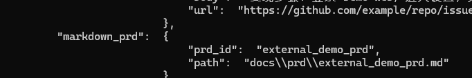

生成结果包含 `feature / keywords / retrieved_knowledge / coverage`：

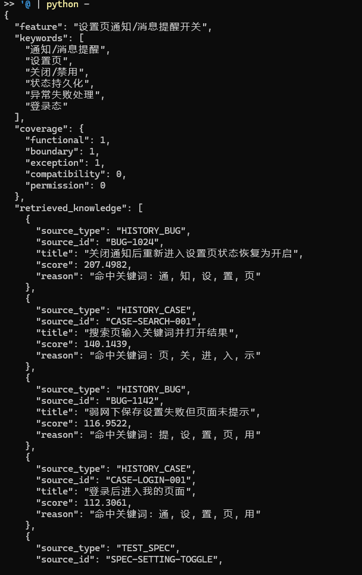

生成测试点 `TP-001 / TP-002`：

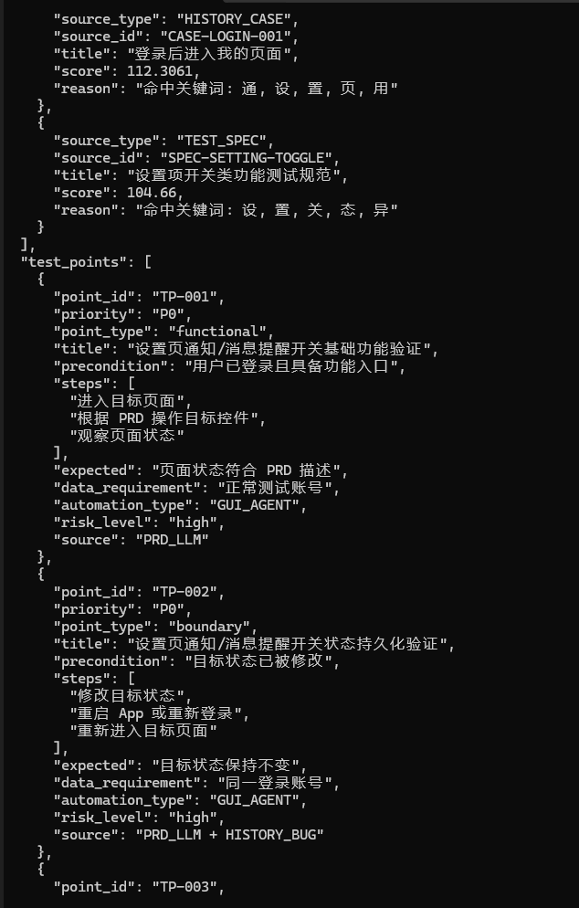

生成异常场景测试点 `TP-003`：

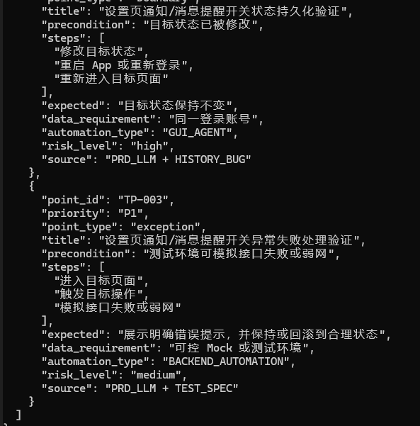

### 4.3 输出 JSON 结构

| 字段 | 含义 |
|---|---|
| `feature` | PRD 对应功能 |
| `keywords` | 自动提取的关键词 |
| `retrieved_knowledge` | 混合检索召回的知识 |
| `test_points` | 生成的结构化测试点 |
| `coverage` | 功能、边界、异常、兼容等覆盖情况 |

### 4.4 对题目要求的满足情况

| 题目要求 | 实现结果 |
|---|---|
| 完整 pipeline | 已实现 PRD → Keyword Extraction → Hybrid Retrieval → Test Point Generation |
| 使用知识库召回 | 已实现历史用例、历史 BUG、测试规范召回 |
| 生成测试点 | 已输出功能、边界、异常场景测试点 |
| JSON 结构化输出 | 已实现结构化 JSON |

---

## 5. 四方向真实业务替代接入与混合自动化结果

### 5.1 四方向跑通情况

| 方向 | 业务案例 | 外部系统 / 输入源 | 最终结果 |
|---|---|---|---|
| 集成测试批量执行 | 搜索 `Yuanbao` 并验证结果列表 | 本地真实 HTTP Web Demo | ✅ 跑通 |
| 开发自测 | Push 后自动验证通知设置链路 + Backend API 冒烟 | GitHub Actions | ✅ 跑通 |
| 需求测试 | 通知设置 PRD 生成测试点 | Markdown PRD 文件 | ✅ 跑通 |
| BUG 回归 | 通知开关关闭后重新进入设置页状态保持 | GitHub Issues | ✅ 跑通 |

接口汇总证据：

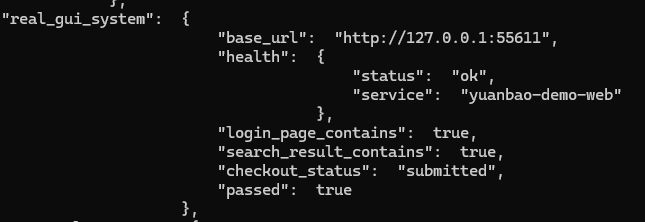

外部系统接入证据：

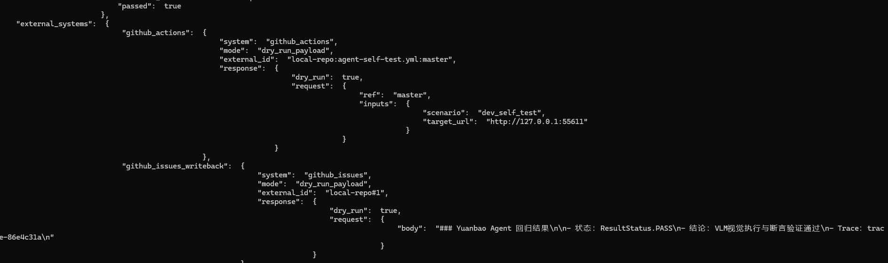

### 5.2 GUI + Backend 混合自动化证据

本项目新增了后台接口自动化闭环：

```text
自然语言后台用例
  ↓
Backend API Case IR
  ↓
BackendAutomationExecutor
  ↓
真实 HTTP API 请求
  ↓
状态码 / JSON 响应断言
  ↓
PASS / FAIL / UNKNOWN 结果
```

混合调度证据：

- `docs/evidence_mixed_automation.json`：同一批次内同时执行 GUI 任务和 Backend API 任务。
- `docs/evidence_ci_gate.json`：CI 构建成功后执行 UI 冒烟 + API 冒烟；构建失败时不进入 Agent 测试调度。
- `docs/evidence_business_trace.json`：同一业务链路先执行 GUI 通知开关操作，再通过 Backend API 查询 `notification_enabled=false`，最后给出统一结论。

同一业务链路总览证据：

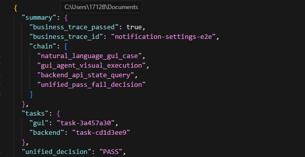

Backend 状态复核证据：

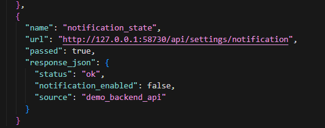

### 5.3 UNKNOWN 人工复核闭环证据

针对不稳定复现、低置信度、页面变化等情况，平台不会强行把所有问题判成失败，而是进入 `UNKNOWN`。新增复核队列后，`UNKNOWN` 结果会保留：

- `review_id`
- `case_id`
- `reason`
- `trace_id`
- `screenshots`
- `actions`
- `confidence`

人工查看截图、trace 和原因后，可以将该项标记为最终 `PASS / FAIL / UNKNOWN`。证据文件：`docs/evidence_review_queue.json`。

UNKNOWN 人工复核完成证据：

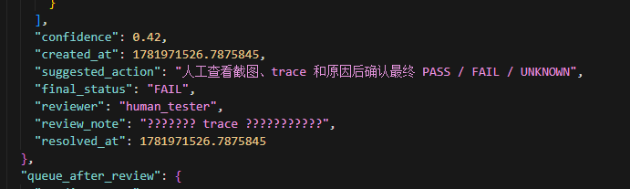

### 5.4 本地 Web Demo 业务证据

登录页：

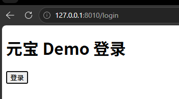

搜索业务：

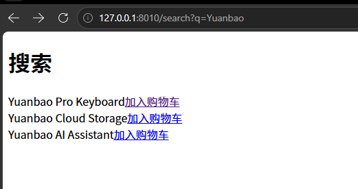

通知开关关闭结果：

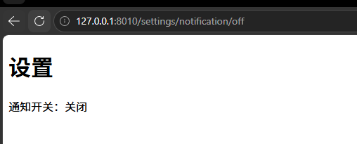

### 5.5 验收结论

本项目已完成：

- 集成测试：搜索业务。
- 开发自测：通知设置 GUI 链路 + Backend API 冒烟。
- 需求测试：通知设置 PRD。
- BUG 回归：通知开关状态保持缺陷。
- 混合调度：同一批次执行 `GUI_AGENT` 与 `BACKEND_AUTOMATION`。
- 同一链路：GUI 操作后由 Backend API 复核状态。
- UNKNOWN：进入人工复核队列并可被人工确认最终结论。

四类方向均完成：业务输入 → Agent 任务生成 → 调度执行 → 结果输出 → 外部系统或报告回写。

因此，在没有元宝内网权限的前提下，项目满足“四类应用方向至少各跑通 1 个真实业务替代接入场景”的验收目标。

---

## 6. 运行方式

### 6.1 运行测试

- 进入项目：`cd C:\Users\17128\Documents\tx-yuanbao`
- 设置路径：`$env:PYTHONPATH="src"`
- 运行测试：`python -m unittest discover -s tests`
- 当前结果：`Ran 32 tests ... OK`

### 6.2 启动 API

- 启动服务：`python -m yuanbao_agent_platform.api`
- 健康检查：`GET http://127.0.0.1:8000/health`
- 外部替代验收：`GET http://127.0.0.1:8000/acceptance/external-substitute`
- Backend 用例转换：`POST http://127.0.0.1:8000/backend/convert`
- GUI + Backend 混合调度：`POST http://127.0.0.1:8000/demo/mixed-automation`
- 同一业务链路 trace：`POST http://127.0.0.1:8000/demo/business-trace`
- CI/CD gate：`POST http://127.0.0.1:8000/ci/gate`
- UNKNOWN 复核队列：`GET http://127.0.0.1:8000/reviews`
- 处理复核项：`POST http://127.0.0.1:8000/reviews/resolve`
- PRD 测试点生成：`POST http://127.0.0.1:8000/prd/test-points`

### 6.3 启动本地 Web Demo

- 启动服务：`python -m yuanbao_agent_platform.demo_web`
- 访问地址：`http://127.0.0.1:8010/login`

---

## 7. 项目边界说明

当前项目已经完成统一测试执行平台的工程闭环，但有两类能力受限于外部权限，需要说明边界：

| 能力 | 当前实现 | 后续真实接入方式 |
|---|---|---|
| GUI Agent 视觉执行 | 使用 `MockVisionAgentClient` 模拟公司已具备的 Vision-Based GUI Agent 能力，接口层保留 `VisionAgentClient` 协议 | 后续拿到办公权限后，将 `VisionAgentClient` 替换为公司真实 GUI Agent / VLM 服务 endpoint |
| Backend API 自动化 | 使用本地真实 HTTP Demo 服务验证接口请求、响应断言和结果回写链路 | 后续接入元宝真实微服务时，替换 `base_url`、鉴权、请求参数和断言配置 |
| 真实业务系统 | 使用本地 Web Demo、GitHub Actions、GitHub Issues、Markdown PRD 做外部真实替代验证 | 后续根据导师分配的具体业务任务，替换为元宝测试环境、公司 CI/CD、缺陷系统和需求系统 |

因此，当前版本不声称已经接入公司内部真实 VLM 或元宝生产微服务；它证明的是平台主链路、调度能力、混合执行能力、CI gate、BUG 回归和结果回写已经工程化跑通，并且关键接入点已经 Adapter / Protocol 化。

---

## 8. 最终结论

本项目完成了“元宝 GUI Agent + Backend API 统一测试执行平台 MVP”的工程实现，四个考题均有对应代码、流程和结果证据。

最终结果：

- ✅ 多场景调度引擎已实现。
- ✅ GUI Agent UI 自动化与 Backend API 自动化混合调度已实现。
- ✅ 自然语言测试用例转换已实现。
- ✅ 自然语言后台接口用例转换与真实 HTTP API 断言已实现。
- ✅ 同一业务链路 GUI 操作 + Backend 状态复核 trace 已实现。
- ✅ BUG 回归闭环已实现。
- ✅ PRD 自动生成测试点已实现。
- ✅ `PASS / FAIL / UNKNOWN` 三态结果已实现。
- ✅ `UNKNOWN` 人工复核队列与人工确认闭环已实现。
- ✅ 页面改版 / 复现路径失效后的重新观察、重新规划、重跑机制已设计。
- ✅ GitHub Actions 真实 CI 替代接入与 UI/API 冒烟 gate 已验证。
- ✅ GitHub Issues 真实缺陷系统替代接入已验证。
- ✅ 四类业务方向均完成真实业务替代验证。
- ✅ 至少两个外部系统完成真实对接，实际覆盖 GitHub Actions、GitHub Issues、Markdown PRD 三类。

项目具备进入真实元宝业务环境继续落地的基础。若后续接入腾讯内部系统，只需要替换对应 Adapter 的 endpoint、鉴权、字段映射和设备资源实现。
