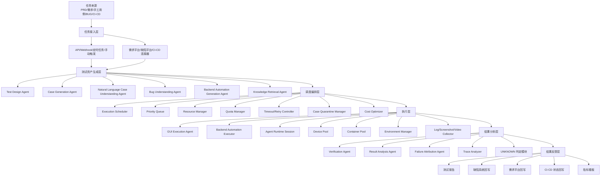
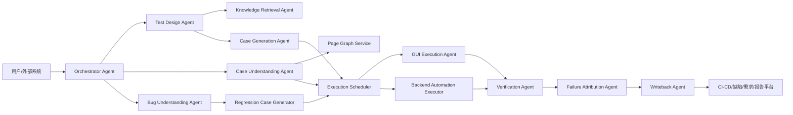
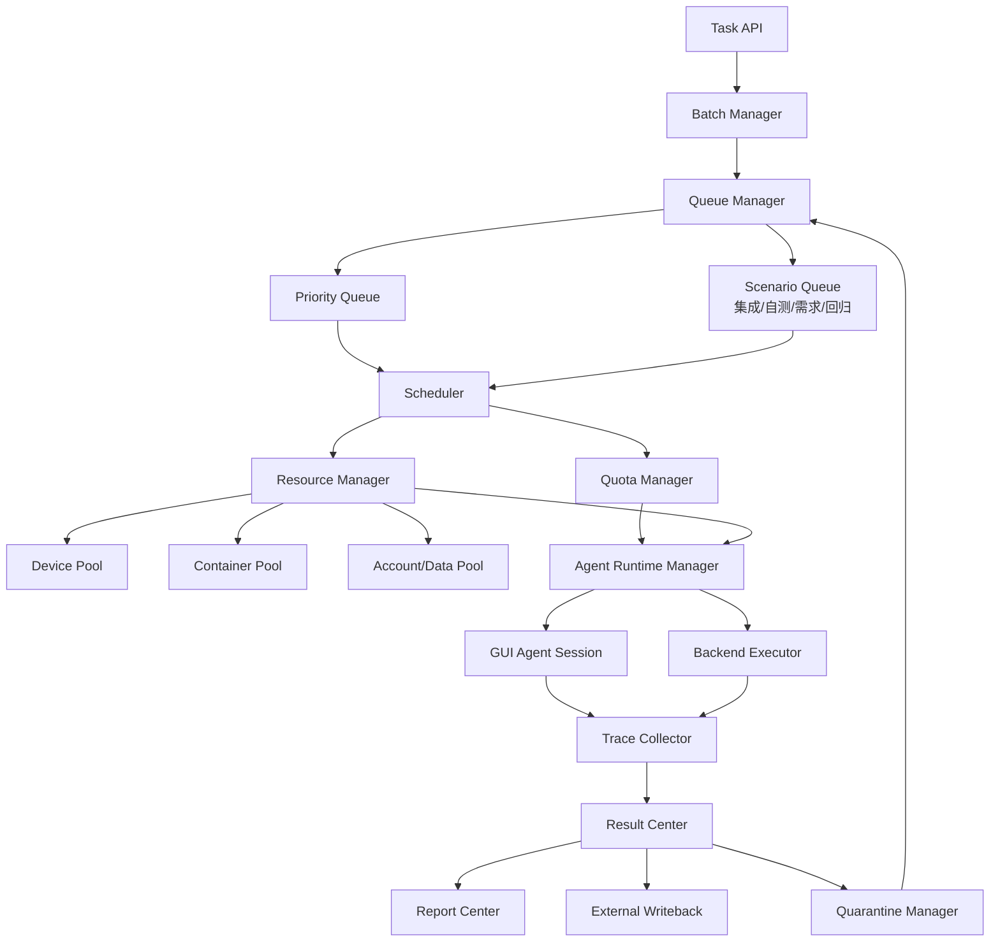
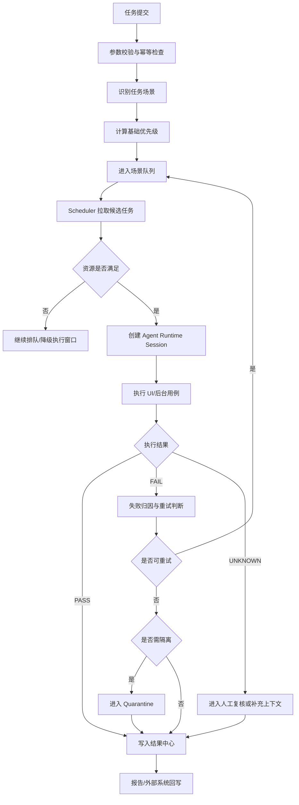
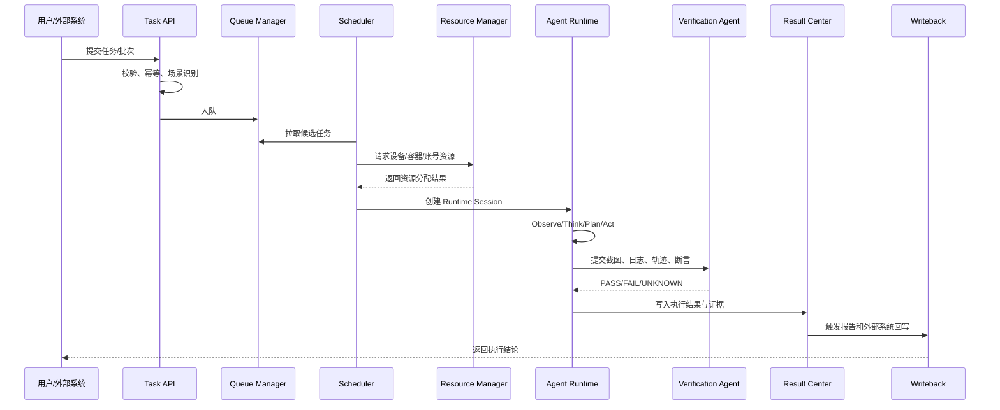
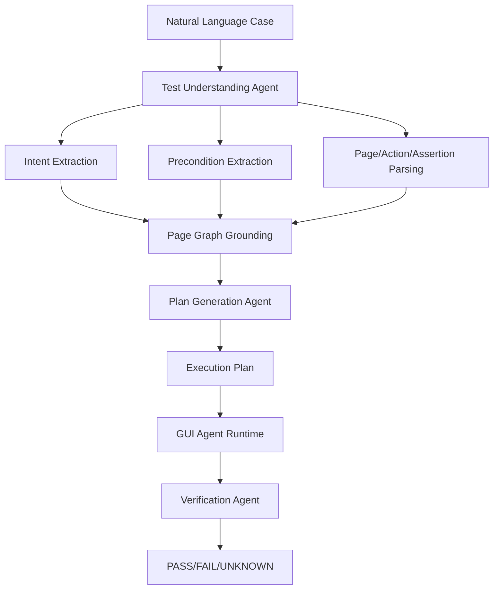
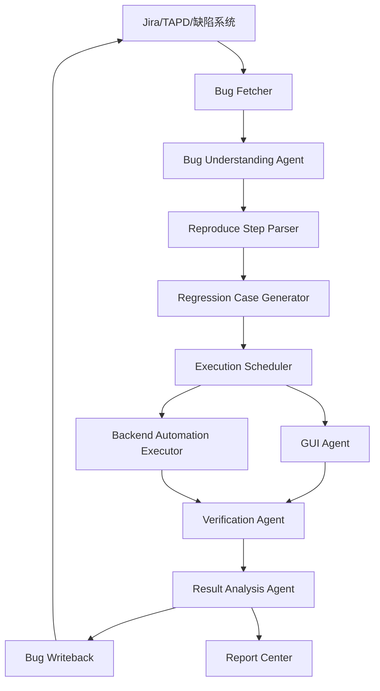
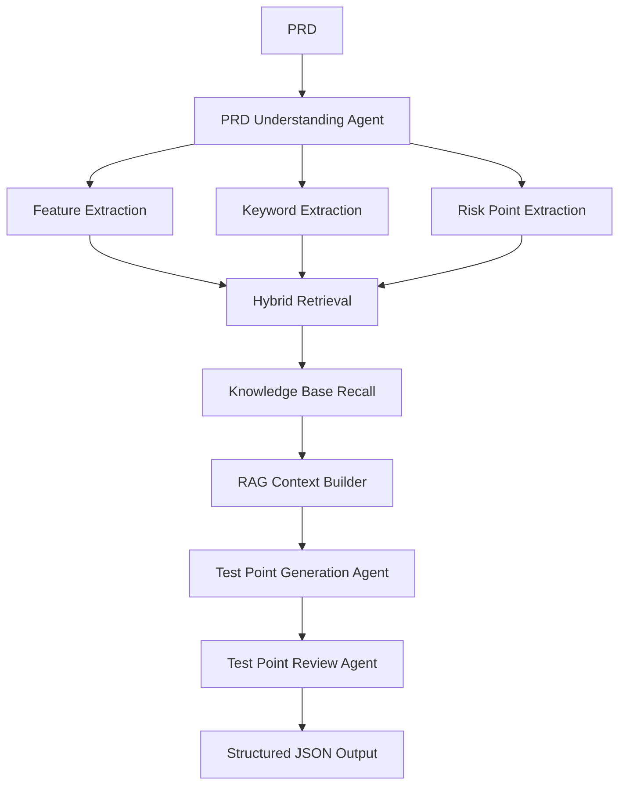

# 元宝 GUI Agent 测试平台建设方案

## 1. 项目定位与核心认知

本项目不是传统脚本驱动的自动化测试平台，而是基于 Vision-Based GUI Agent 的测试 Agent 应用平台。平台复用公司已有 GUI Agent UI 自动化执行框架与后台自动化自动生成框架，在其上建设任务接入、测试资产生成、执行调度、结果分析、失败归因、报告展示和系统回写能力。

GUI Agent 的主执行链路不是 XPath、ResourceId、固定坐标或 Appium 脚本，而是基于多模态模型观察页面截图，理解自然语言任务，自主规划并执行点击、输入、滑动、跳转和视觉验证。传统控件信息、历史坐标、OCR、Accessibility 信息可以作为辅助上下文和调试证据，但不能作为核心执行假设。

平台目标是打通以下闭环：

```text
PRD / 需求 / 手工用例 / BUG / CI/CD
        ↓
测试点生成
        ↓
测试用例生成
        ↓
UI Agent 执行 + 后台自动化执行
        ↓
结果分析与失败归因
        ↓
报告生成
        ↓
缺陷 / 需求 / CI/CD 回写
```

目标用户是测试开发、专项测试、系统测试和测试负责人。平台需要服务真实工程工作流，重点支持批次管理、队列管理、资源调度、并发执行、失败重跑、结果归因、截图录屏、Agent 决策轨迹和可视化报告。

## 2. 总体架构设计



### 2.1 关键模块职责

| 模块 | 职责 | 关键输出 |
| --- | --- | --- |
| Test Design Agent | 从 PRD、验收标准中识别功能点、风险点、边界条件 | 测试点 JSON |
| Case Generation Agent | 将测试点转成 UI 用例、后台用例或人工复核用例 | TestCase |
| NL Case Understanding Agent | 将自然语言手工用例转成语义化 Agent Plan | AgentPlan |
| Bug Understanding Agent | 解析 BUG 标题、描述、复现步骤、期望结果和附件 | RegressionCase |
| Backend Automation Generation Agent | 复用后台自动化生成框架，生成或补全接口/后台用例 | BackendTestCase |
| Execution Scheduler | 管理优先级、并发、资源、超时、重试和隔离 | ExecutionJob |
| GUI Execution Agent | 基于视觉感知执行 UI 用例 | ExecutionTrace |
| Verification Agent | 根据断言和视觉证据判定 PASS/FAIL/UNKNOWN | ExecutionResult |
| Failure Attribution Agent | 区分用例失败、Agent 失败、环境失败、产品缺陷 | FailureReason |
| Result Center | 汇总结果、证据、报告和外部系统回写状态 | Report/Writeback |

### 2.2 Multi-Agent 协作架构



协作原则：

- Orchestrator Agent 负责流程编排，不直接执行 UI 操作。
- GUI Execution Agent 只消费语义化 Agent Plan，不消费传统 XPath 脚本。
- Verification Agent 与 Execution Agent 分离，避免执行模型自己给自己无约束打分。
- Failure Attribution Agent 使用执行轨迹、截图、日志、环境状态和历史稳定性做归因。
- Knowledge Retrieval Agent 为 PRD 测试点生成、模糊用例澄清和 BUG 复现步骤补全提供知识上下文。

## 3. 数据流与任务流

平台数据流分为测试资产流、执行任务流和反馈闭环流。

```text
测试资产流：PRD/手工用例/BUG → 解析 → IR → TestCase/AgentPlan
执行任务流：TestCase/AgentPlan → Batch/Job → Scheduler → Runtime Session → Trace/Result
反馈闭环流：Result → 归因 → 报告 → 缺陷/需求/CI-CD 回写 → 指标沉淀
```

UI 用例与后台自动化用例可以并行执行，也可以按照依赖串行执行。例如“前端提交表单 + 后台校验数据落库”适合 UI 步骤先执行，后台校验步骤后执行；纯接口逻辑和 UI 冒烟则可并发执行以降低整体耗时。

## 4. 考题一：多场景调度引擎设计

### 4.1 调度引擎架构



### 4.2 四类任务差异化策略表

| 维度 | 集成测试大批量执行 | 开发自测 | 需求测试 | BUG 回归 |
| --- | --- | --- | --- | --- |
| 任务来源 | 存量手工用例、用例库、批次计划 | PRD、代码变更、CI/CD 构建 | 需求单、验收标准、测试点 | 缺陷系统待回归 BUG |
| 触发方式 | 手动批次、夜间定时、版本计划 | CI/CD、开发手动触发 | 需求状态变更、测试手动触发 | 手动、定时、状态流转、构建完成 |
| 优先级 | 中等，吞吐优先 | 高，反馈优先 | 中高，覆盖优先 | 高，与缺陷流转强绑定 |
| 资源配额 | 大配额，可使用低峰资源 | 小配额，保证快速启动 | 中等配额，按需求优先级调整 | 中高配额，按缺陷严重级别调整 |
| 并发度 | 高并发，多设备/容器 | 低到中并发，快速冒烟 | 中并发，保障覆盖质量 | 中并发，严重 BUG 可提升 |
| 超时策略 | 单用例较宽松，批次有总超时 | 严格超时，快速失败 | 中等超时，复杂链路可放宽 | 依 BUG 复现复杂度动态设置 |
| 重试策略 | 环境/Agent 失败可批量重试 | 少量重试，避免阻塞 CI | 关键用例可重试 | 失败需谨慎重试并保留证据 |
| 是否允许排队 | 允许 | 尽量少排队 | 允许 | 允许但高优先级插队 |
| 是否允许抢占 | 通常不抢占 | 可抢占低优先级任务 | 关键需求可抢占 | P0/P1 BUG 可抢占 |
| 回写目标 | 测试报告、用例平台 | CI/CD、提测准入 | 需求平台、覆盖报告 | 缺陷系统 |
| 执行窗口 | 夜间、低峰、版本集成期 | 提测前、每次构建后 | 需求测试阶段 | 待回归状态、夜间批量 |

### 4.3 调度策略

调度引擎采用“场景队列隔离 + 全局加权公平调度 + 任务优先级动态修正”的策略。每类场景拥有独立队列和基础资源配额，避免集成测试大批量任务挤占开发自测与 BUG 回归资源。全局调度器按业务优先级、等待时长、缺陷严重等级、CI 阻塞程度、用例历史稳定性和资源成本计算综合分。

核心策略：

- 优先级调度：P0/P1 BUG 回归、CI/CD 准入任务优先。
- 加权公平调度：保证四类场景都有最低资源水位。
- 资源配额：按业务线、场景、优先级和设备类型分配。
- 队列隔离：集成批量、开发自测、需求测试、BUG 回归独立排队。
- 并发控制：按设备池、容器池、Agent 推理额度、账号池综合限流。
- Session 管理：一个 Agent Runtime Session 绑定执行上下文、设备、账号、环境、日志采集器和超时控制器。
- 成本优化：低优先级批量任务在低峰执行，高成本 Agent 推理优先用于高价值任务。
- 问题用例隔离：连续失败、超时、UNKNOWN 或低置信度用例进入 Quarantine。

### 4.4 调度流程图



### 4.5 调度时序图



### 4.6 失败处理机制

失败类型：

- 用例失败：实际产品行为不符合预期。
- Agent 执行失败：识别控件失败、规划错误、误点、超过最大步骤数。
- 环境失败：设备不可用、构建包异常、账号数据异常。
- 网络失败：服务超时、接口不可达、弱网异常。
- 被测应用崩溃：闪退、白屏、卡死。
- Agent 无法判定：断言不明确、视觉置信度低、页面变化过大。

处理策略：

- 环境失败优先重置环境、换设备、换账号后重试。
- Agent 执行失败可基于历史轨迹、Page Graph 和 OCR 上下文自愈重试。
- 用例断言失败不盲目多次重试，优先保留证据并做失败归因。
- 连续超时、连续 UNKNOWN、历史失败率高的用例进入 Quarantine。
- Quarantine 用例不进入主执行队列，只允许低峰复跑或人工复核后释放。

### 4.7 核心伪代码

```python
def enqueue_task(raw_task):
    task = normalize_task(raw_task)
    if idempotency_exists(task.idempotency_key):
        return get_existing_task(task.idempotency_key)

    task.priority = calculate_priority(task)
    task.timeout = resolve_timeout(task)
    task.max_retry = resolve_retry_limit(task)
    task.queue = resolve_scenario_queue(task.scenario)
    save_task(task)
    push_queue(task.queue, task)
    return task


def calculate_priority(task):
    base = {
        "DEV_SELF_TEST": 90,
        "BUG_REGRESSION": 85,
        "REQUIREMENT_TEST": 70,
        "INTEGRATION_BATCH": 50,
    }[task.scenario]

    if task.bug_severity == "P0":
        base += 20
    if task.is_ci_blocking:
        base += 15
    if task.waiting_minutes > 30:
        base += min(10, task.waiting_minutes // 10)
    if task.case_flaky_score > 0.7:
        base -= 20

    return clamp(base, 0, 100)
```

```python
def schedule_loop():
    while True:
        candidates = queue_manager.pick_candidates_by_weight()
        for task in sort_by_priority(candidates):
            if quarantine_manager.is_blocked(task.case_id):
                mark_skipped(task, reason="CASE_IN_QUARANTINE")
                continue

            resource = resource_manager.allocate(task.resource_requirements)
            if not resource:
                continue

            session = runtime_manager.create_session(task, resource)
            result = execute_with_timeout(session, task.timeout)

            if result.status in ["PASS", "FAIL"]:
                result_center.save(result)
                writeback.dispatch(result)
                resource_manager.release(resource)
                continue

            if should_retry(task, result):
                task.retry_count += 1
                environment_manager.rollback(resource)
                queue_manager.requeue(task)
            else:
                if should_quarantine(task, result):
                    quarantine_manager.block(task.case_id, result.reason)
                result_center.save(result)
                writeback.dispatch(result)

            resource_manager.release(resource)
```

## 5. 考题二：自然语言用例到 Agent 可执行用例转换

### 5.1 转换链路



自然语言转换的关键不是生成选择器脚本，而是把人工用例转成稳定的语义任务。转换结果应描述目标页面、操作意图、视觉目标、预期状态、断言标准和允许的自愈策略。

### 5.2 模糊表达处理

| 问题 | 处理方式 |
| --- | --- |
| “我的页面”“设置入口”等页面别名 | 使用 Page Graph 的页面别名、入口路径和历史导航轨迹归一化 |
| “关闭通知”缺少控件名 | 基于页面知识、历史用例和 OCR 候选项补全为“通知开关” |
| “验证状态保留”断言不明确 | 补全为“重新进入设置页后通知开关仍为关闭状态” |
| 跨页面跳转路径缺失 | 由 Page Graph 生成候选导航路径，执行中由 Agent 视觉确认 |
| 页面变化导致入口位置变化 | GUI Agent 自主观察页面并寻找语义目标，失败时使用历史轨迹辅助 |
| 断言置信度低 | 返回 UNKNOWN 并要求人工复核或补充断言 |

### 5.3 中间表示 IR 示例

```json
{
  "case_id": "case_notification_001",
  "title": "关闭通知开关后状态保留",
  "goal": "验证用户关闭通知开关后，再次进入设置页开关仍保持关闭",
  "preconditions": [
    "用户已登录",
    "账号存在通知设置入口"
  ],
  "pages": [
    {
      "name": "我的",
      "aliases": ["个人中心", "Mine"]
    },
    {
      "name": "设置",
      "aliases": ["系统设置", "Settings"]
    }
  ],
  "steps": [
    {
      "step_id": "s1",
      "action_intent": "navigate",
      "target_semantics": "我的页面",
      "visual_hints": ["底部导航", "我的", "头像或个人信息区域"],
      "assertions": ["当前页面为我的页面"]
    },
    {
      "step_id": "s2",
      "action_intent": "tap",
      "target_semantics": "设置入口",
      "visual_hints": ["设置", "齿轮图标", "列表项"],
      "assertions": ["进入设置页面"]
    },
    {
      "step_id": "s3",
      "action_intent": "set_toggle",
      "target_semantics": "通知开关",
      "desired_state": "off",
      "visual_hints": ["通知", "消息提醒", "开关控件"],
      "assertions": ["通知开关为关闭状态"]
    },
    {
      "step_id": "s4",
      "action_intent": "verify_persistence",
      "target_semantics": "通知开关状态保留",
      "assertions": ["重新进入设置页后通知开关仍为关闭"]
    }
  ],
  "fallback_strategy": [
    "如果设置入口不可见，尝试滚动当前页面",
    "如果通知开关名称不完全匹配，查找消息提醒、推送通知等同义项",
    "如果无法确定开关状态，输出 UNKNOWN"
  ],
  "confidence": 0.86,
  "need_human_review": false
}
```

### 5.4 最终 Agent Plan 示例

```json
{
  "plan_id": "plan_notification_001",
  "task_goal": "关闭通知开关并验证状态保留",
  "execution_mode": "VISION_BASED_GUI_AGENT",
  "context": {
    "app": "元宝",
    "user_state": "logged_in",
    "entry": "app_home",
    "page_graph_scope": ["首页", "我的", "设置"]
  },
  "max_steps": 20,
  "timeout_seconds": 180,
  "steps": [
    {
      "intent": "进入我的页面",
      "visual_target": "底部导航或页面入口中名为“我的”的入口",
      "success_criteria": "页面展示个人信息、头像或我的页面标题",
      "unknown_criteria": "无法找到我的入口或页面状态无法识别"
    },
    {
      "intent": "进入设置页面",
      "visual_target": "设置入口，可能是文字“设置”或齿轮图标",
      "success_criteria": "页面标题或内容表明已进入设置页"
    },
    {
      "intent": "关闭通知开关",
      "visual_target": "与通知、消息提醒或推送相关的开关",
      "success_criteria": "开关视觉状态为关闭",
      "failure_criteria": "开关无法操作或操作后仍为开启"
    },
    {
      "intent": "验证状态保留",
      "visual_target": "重新进入设置页后的通知开关",
      "success_criteria": "通知开关仍处于关闭状态",
      "unknown_criteria": "无法确认开关状态或页面发生不可识别变化"
    }
  ],
  "self_healing": {
    "allow_scroll": true,
    "allow_backtrack": true,
    "allow_synonym_match": true,
    "allow_page_graph_reroute": true,
    "max_recovery_attempts": 3
  },
  "result_schema": ["PASS", "FAIL", "UNKNOWN"]
}
```

### 5.5 执行与验证

Agent 执行时按 Observe → Think → Plan → Act → Verify 循环推进。每一步都记录截图、视觉候选、动作决策、置信度、页面跳转结果和验证结论。若目标入口不可见，Agent 可滚动或基于 Page Graph 回退重走路径。若断言视觉状态无法稳定识别，则结果为 UNKNOWN，而不是强行判定失败。

## 6. 考题三：BUG 回归端到端方案

### 6.1 端到端链路



### 6.2 BUG 解析字段

BUG Understanding Agent 需要解析标题、描述、影响版本、修复版本、复现环境、前置条件、复现步骤、实际结果、期望结果、截图、录屏、日志、关联需求、严重等级、缺陷状态和修复人。解析后生成 RegressionCase，并标记是否需要人工补充信息。

### 6.3 回归触发机制

- 手动触发：测试人员在缺陷单或平台页面选择一个或多个 BUG 发起回归。
- 定时触发：每天低峰扫描“待回归”BUG，按业务线和版本批量执行。
- 状态流转触发：缺陷状态从“已修复”流转到“待回归”时通过 Webhook 创建任务。
- CI/CD 触发：修复分支构建完成后自动触发关联 BUG 回归。
- 批量版本回归：按版本、业务线、严重等级筛选 BUG 批量执行。

### 6.4 回归执行设计

BUG 回归执行前需要准备构建包、设备或容器、账号、数据、网络条件和依赖服务。复现步骤先转成 Agent Plan，若 BUG 涉及后台数据或接口校验，则同步生成 Backend Automation 用例。执行结束后，Verification Agent 对比期望结果、历史失败截图、当前页面状态、后台校验结果和日志证据，输出三态结论。

### 6.5 三态回写设计

| 状态 | 含义 | 回写动作 |
| --- | --- | --- |
| PASS | BUG 已修复，未复现原问题 | 回写成功回归，附执行证据，可建议关闭 |
| FAIL | BUG 仍存在或出现同类异常 | 回写回归失败，附复现截图、录屏、日志和轨迹 |
| UNKNOWN | Agent 无法可靠判断 | 回写无法判定原因，建议人工复核 |

UNKNOWN 原因包括页面变化、复现步骤缺失、环境不可用、数据不满足、视觉识别置信度低、断言点不明确、应用异常或后台依赖异常。

回写内容包括回归状态、执行结论、失败原因、UNKNOWN 原因、截图、录屏、日志、Agent 操作轨迹、AI 决策轨迹、执行环境、执行版本、执行时间和是否建议人工复核。

### 6.6 BUG 回归示例

输入 BUG：

```json
{
  "bugId": "BUG-1024",
  "title": "关闭通知开关后重新进入设置页仍显示开启",
  "status": "待回归",
  "severity": "P1",
  "version": "8.1.0",
  "steps": [
    "登录账号",
    "进入我的页面",
    "点击设置",
    "关闭通知开关",
    "退出设置页后重新进入"
  ],
  "expected": "通知开关保持关闭",
  "actual": "通知开关重新变为开启"
}
```

回归输出：

```json
{
  "bugId": "BUG-1024",
  "result": "PASS",
  "conclusion": "回归通过，通知开关重新进入后仍保持关闭",
  "evidence": {
    "screenshots": ["step3_setting_page.png", "step5_verify_toggle_off.png"],
    "video": "BUG-1024-regression.mp4",
    "trace": "BUG-1024-agent-trace.json"
  },
  "environment": {
    "appVersion": "8.1.1",
    "device": "Android-13",
    "build": "20260615.1"
  },
  "needHumanReview": false
}
```

### 6.7 BUG 回归指标

- 自动回归覆盖率：已自动回归 BUG 数 / 待回归 BUG 总数。
- 人工回归替代率：无需人工执行的回归数 / 总回归数。
- Agent 执行成功率：PASS + FAIL 可明确判定数 / 总执行数。
- UNKNOWN 占比：UNKNOWN 数 / 总执行数。
- 误报率：Agent 判 FAIL 但人工确认 PASS 的比例。
- 漏报率：Agent 判 PASS 但人工或线上发现仍有问题的比例。
- 平均执行时长、平均排队时长、回归吞吐量、缺陷关闭加速率、人工复核率、结果采纳率。

## 7. 考题四：基于 PRD 召回知识库生成测试点

### 7.1 Pipeline



### 7.2 知识库与检索设计

知识库包括历史测试用例、历史 BUG、测试规范、业务规则、页面知识图谱、接口文档、PRD 历史版本、线上问题案例、边界条件库和异常场景库。

混合检索策略：

- BM25 负责精确关键词召回，例如功能名、页面名、字段名、错误码。
- Embedding 负责语义相似召回，例如同类功能、相似历史缺陷。
- 业务标签、页面模块、缺陷严重等级和时间范围用于过滤。
- 时间衰减权重提升近期线上问题和近期同模块缺陷。
- Rerank 根据 PRD 功能相关性、风险相似度、可复用测试价值重排。
- RAG Context Builder 只保留与当前功能、边界条件和异常路径强相关的知识，降低噪声。

### 7.3 PRD 到测试点示例

输入 PRD 片段：

```text
用户可在设置页关闭通知开关。关闭后，系统不再发送消息推送。
用户重新登录、重启 App 或切换网络后，通知开关状态应保持不变。
若接口保存失败，应提示用户稍后重试，并保持原状态。
```

关键词提取：

```json
{
  "features": ["通知开关", "设置页", "状态持久化", "消息推送"],
  "keywords": ["关闭通知", "重新登录", "重启 App", "切换网络", "接口保存失败", "原状态"],
  "riskPoints": ["状态未持久化", "前后端状态不一致", "失败提示缺失", "弱网保存异常"]
}
```

最终测试点 JSON：

```json
{
  "prdId": "PRD-2026-001",
  "feature": "设置页通知开关",
  "summary": "验证用户关闭通知开关后的状态持久化、推送控制和异常处理",
  "keywords": ["通知开关", "设置页", "状态持久化", "接口保存失败"],
  "retrievedKnowledge": [
    {
      "sourceType": "HISTORY_BUG",
      "sourceId": "BUG-1024",
      "title": "关闭通知后重新进入设置页状态恢复为开启",
      "score": 0.92,
      "reason": "同功能同断言，覆盖状态持久化风险"
    },
    {
      "sourceType": "TEST_SPEC",
      "sourceId": "SPEC-SETTING-TOGGLE",
      "title": "设置项开关类功能测试规范",
      "score": 0.88,
      "reason": "提供开关状态、失败回滚和多端一致性测试规则"
    }
  ],
  "testPoints": [
    {
      "id": "TP-001",
      "priority": "P0",
      "type": "functional",
      "title": "关闭通知开关后页面状态立即变为关闭",
      "precondition": "用户已登录且通知开关当前为开启",
      "steps": ["进入我的页面", "进入设置页", "关闭通知开关"],
      "expected": "通知开关显示为关闭状态",
      "dataRequirement": "具备通知设置权限的账号",
      "automationType": "GUI_AGENT",
      "riskLevel": "high",
      "source": "PRD + TEST_SPEC"
    },
    {
      "id": "TP-002",
      "priority": "P0",
      "type": "boundary",
      "title": "重启 App 后通知开关状态保持关闭",
      "precondition": "通知开关已关闭",
      "steps": ["关闭 App", "重新启动 App", "进入设置页查看通知开关"],
      "expected": "通知开关仍为关闭状态",
      "dataRequirement": "同一登录账号",
      "automationType": "GUI_AGENT",
      "riskLevel": "high",
      "source": "HISTORY_BUG"
    },
    {
      "id": "TP-003",
      "priority": "P1",
      "type": "exception",
      "title": "保存接口失败时提示稍后重试并保持原状态",
      "precondition": "通过 Mock 或测试环境制造保存接口失败",
      "steps": ["进入设置页", "切换通知开关", "触发保存失败"],
      "expected": "页面提示稍后重试，开关回到切换前状态",
      "dataRequirement": "可控制接口失败的测试环境",
      "automationType": "GUI_AGENT | BACKEND_AUTOMATION",
      "riskLevel": "medium",
      "source": "PRD"
    }
  ],
  "coverage": {
    "functional": 1,
    "boundary": 1,
    "exception": 1,
    "compatibility": 0,
    "permission": 0
  },
  "needHumanReview": false
}
```

## 8. 四类业务场景落地方案

### 8.1 集成测试阶段大批量执行

输入是存量 UI 手工用例、后台用例、版本信息和目标环境。测试人员创建批次后，平台将自然语言 UI 用例转成 Agent Plan，将后台用例交给后台自动化框架生成或补全。Scheduler 按低峰窗口进行高并发调度，GUI Agent 和后台执行器并行执行。输出批次报告，包括通过率、失败截图、关键步骤回放、AI 决策轨迹、失败归因和用例稳定性。

真实业务接入示例：版本集成阶段导入“设置模块 500 条存量手工用例”，夜间调度 20 台设备并发执行，次日输出失败归因报告并自动重跑环境失败用例。

### 8.2 开发自测

输入是 PRD、代码变更、开发分支构建包和核心冒烟用例。CI/CD 构建完成后触发平台生成或选择核心 UI/后台用例，在开发分支产物上快速执行。若 P0 冒烟失败，CI/CD 状态回写失败并阻止提测；若 UNKNOWN 占比过高，要求人工复核。

真实业务接入示例：开发提交“通知设置优化”分支后，CI 触发 15 条核心冒烟用例，5 分钟内回写构建准入结果。

### 8.3 需求新功能测试

输入是需求单、验收标准、PRD 和关联设计。平台拉取需求内容后生成测试点和用例，GUI Agent 执行 UI 链路，后台自动化框架生成接口校验用例。结果回写需求平台，展示覆盖度、通过率、缺陷清单和未覆盖风险。

真实业务接入示例：需求单“设置页通知开关新增失败回滚提示”，平台生成功能、异常、边界测试点，并输出需求覆盖度报告。

### 8.4 BUG 回归

输入是缺陷系统中状态为“待回归”的 BUG。平台解析复现步骤生成回归用例，调度 GUI Agent 和后台执行器执行，结果以 PASS/FAIL/UNKNOWN 三态回写缺陷单。支持批量回归、定时回归和状态流转触发。

真实业务接入示例：扫描 P0/P1 待回归端上 BUG，按修复版本批量执行，失败时自动附带复现截图、录屏和 Agent 决策轨迹。

## 9. 系统对接设计

建议优先对接缺陷管理系统和 CI/CD 系统，先跑通 BUG 回归和开发自测两个高价值闭环，再扩展需求管理系统。

| 系统 | 对接方式 | 关键字段 | 回写内容 | 优先级 |
| --- | --- | --- | --- | --- |
| 缺陷管理系统 | REST API + Webhook | bugId、状态、版本、复现步骤、严重等级 | PASS/FAIL/UNKNOWN、证据、复核建议 | P0 |
| CI/CD 系统 | Pipeline API + Webhook | buildId、branch、commit、artifact、triggerUser | 准入状态、失败原因、报告链接 | P0 |
| 需求管理系统 | REST API | requirementId、PRD、验收标准、需求状态 | 覆盖度、用例清单、缺陷清单 | P1 |

工程要点：

- 鉴权使用平台 Token、OAuth 或公司内部服务身份。
- 所有外部回写具备幂等 key，例如 taskId + externalId + resultVersion。
- Webhook 消息先落库再异步处理，避免外部系统抖动导致丢任务。
- 回写失败进入重试队列，超过阈值后告警。
- 数据字段映射通过配置中心维护，支持不同业务线差异。
- 权限按业务线、项目、角色隔离，敏感日志和截图脱敏。

## 10. 核心数据模型

| 模型 | 关键字段 |
| --- | --- |
| Task | task_id、scenario、source、priority、status、trigger_type、deadline、idempotency_key |
| Batch | batch_id、scenario、case_count、owner、schedule_window、progress、summary |
| TestCase | case_id、type、title、source、preconditions、steps、assertions、automation_type、owner |
| TestStep | step_id、intent、target_semantics、visual_hints、expected_state、timeout |
| Assertion | assertion_id、assertion_type、expected、pass_criteria、fail_criteria、unknown_criteria |
| AgentPlan | plan_id、goal、context、steps、max_steps、timeout、self_healing、result_schema |
| ExecutionJob | job_id、task_id、case_id、resource_requirement、retry_count、status |
| AgentSession | session_id、job_id、device_id、account_id、app_version、start_time、runtime_config |
| ExecutionTrace | trace_id、session_id、screenshots、actions、thoughts、confidence、logs、video |
| ExecutionResult | result_id、job_id、status、reason、evidence、duration、confidence |
| BugRegressionResult | bug_id、result、writeback_status、unknown_reason、need_human_review |
| TestPoint | point_id、feature、type、priority、steps、expected、risk_level、automation_type |
| KnowledgeChunk | chunk_id、source_type、source_id、content、embedding、tags、updated_at |
| Report | report_id、batch_id、summary、pass_rate、unknown_rate、failure_analysis、links |

ExecutionResult 状态必须支持 PASS、FAIL、UNKNOWN、BLOCKED、SKIPPED。TestCase 的 automation_type 必须兼容 GUI_AGENT、BACKEND_AUTOMATION 和 MANUAL_REVIEW。

## 11. 异常处理与稳定性机制

平台稳定性依赖五类机制：

- Self-Healing：入口不可见时滚动、回退、重走 Page Graph、同义词匹配、补充 OCR。
- Quarantine：连续失败、连续超时、连续 UNKNOWN 或历史不稳定用例进入隔离池。
- 环境回滚：执行前后重置 App、账号、测试数据、Mock 配置和网络状态。
- 证据完整性：每个失败和 UNKNOWN 都保留截图、录屏、日志、Agent 思考轨迹和动作轨迹。
- 人工复核闭环：UNKNOWN、低置信度断言、关键 BUG 回归失败进入人工复核，并把复核结论沉淀进 Agent Memory。

## 12. Agent 关键能力设计

| 能力 | 设计要点 | 落地价值 |
| --- | --- | --- |
| Vision-Based GUI Agent | 以截图、OCR、视觉区域和自然语言目标为输入，自主完成 Observe、Think、Plan、Act、Verify | 避免强依赖 XPath、坐标和脚本，提升跨版本适应性 |
| Planning Agent | 将测试目标拆解为可执行步骤，并在执行过程中动态调整计划 | 支持跨页面跳转、路径变化和复杂任务执行 |
| Verification Agent | 独立判断页面状态、视觉断言、后台校验和最终结果 | 降低执行 Agent 自证偏差，提高判定可信度 |
| Failure Attribution Agent | 综合截图、录屏、日志、环境状态、后台结果和历史稳定性做失败归因 | 区分产品缺陷、环境异常、Agent 失败和用例问题 |
| Page Graph | 沉淀页面、入口、跳转关系、页面别名和常见路径 | 支撑跨页面导航、模糊表达消歧和自愈重试 |
| Knowledge Graph | 连接需求、用例、BUG、页面、接口、业务规则和历史风险 | 支撑测试点生成、用例补全和风险召回 |
| RAG | 通过 BM25、Embedding、过滤和 Rerank 召回相关测试资产 | 提升 PRD 测试点生成质量，减少遗漏 |
| Agent Memory | 记录历史成功路径、失败模式、控件同义词、复核结论和稳定性分 | 让 Agent 越执行越稳定，降低重复失败 |
| Self-Healing | 支持滚动查找、返回重试、Page Graph 重路由、同义词匹配和环境重置 | 降低页面小变化造成的失败 |
| 三态判定 | PASS、FAIL、UNKNOWN 分离，UNKNOWN 进入人工复核或补充上下文 | 避免低置信度场景被误判为失败或成功 |
| Case Quarantine | 对连续失败、超时、UNKNOWN 和高不稳定分用例隔离 | 防止问题 Case 长期占用主执行资源 |
| Runtime Session | 绑定任务、设备、账号、环境、上下文、日志和超时控制 | 保证执行过程可追踪、可恢复、可审计 |
| 规模化调度 | 队列隔离、配额管理、加权公平、抢占和低峰执行 | 支撑大批量集成测试和多业务线并发接入 |
| 可观测性 | 记录步骤截图、动作轨迹、推理摘要、日志、视频、资源状态 | 支撑失败复盘、报告展示和外部系统采信 |
| 可运营性 | 提供指标看板、隔离池治理、复核队列和成本分析 | 支撑平台长期迭代和业务推广 |

## 13. 指标体系与验收标准

### 13.1 平台指标

| 类型 | 指标 |
| --- | --- |
| 效率指标 | 人工执行替代率、自动化执行覆盖率、平均执行时长、平均排队时长、单日执行用例数、回归吞吐量 |
| 质量指标 | Agent 执行成功率、PASS/FAIL/UNKNOWN 占比、误报率、漏报率、失败归因准确率、用例稳定性 |
| 成本指标 | 单用例执行成本、设备利用率、容器利用率、Agent Token/推理成本、重试成本 |
| 业务指标 | 提测准入拦截率、BUG 回归替代率、需求测试覆盖度、缺陷发现率、缺陷关闭加速率、人工复核率 |

### 13.2 验收标准

- 四类应用方向端到端打通：集成测试批量执行、开发自测、需求测试、BUG 回归。
- 每个方向至少有一个真实业务接入示例。
- 至少完成 CI/CD、缺陷管理系统、需求管理系统中的两个对接设计，优先 CI/CD 和缺陷管理系统。
- 复用已有 GUI Agent 框架和后台自动化生成框架。
- 输出可视化报告和可度量指标。
- 能够回传截图、录屏、日志、Agent 决策轨迹和失败归因。

## 14. 分阶段落地路线图

| 阶段 | 目标 | 核心交付 |
| --- | --- | --- |
| MVP 阶段 | 跑通 BUG 回归和开发自测闭环 | 缺陷系统对接、CI/CD 对接、基础调度、三态回写、报告链接 |
| 扩展阶段 | 支持集成测试批量执行 | 批次管理、队列隔离、设备池调度、失败重跑、批量报告 |
| 增强阶段 | 支持需求测试和 PRD 测试点生成 | 需求平台对接、RAG 知识库、测试点 JSON、覆盖度报告 |
| 规模化阶段 | 多业务线推广与运营 | 多租户配额、成本优化、指标看板、Quarantine 运营、Agent Memory |

优先路径建议：

```text
统一数据模型
  ↓
调度执行底座
  ↓
缺陷系统 + CI/CD 对接
  ↓
BUG 回归和开发自测 MVP
  ↓
自然语言用例转换
  ↓
集成测试批量执行
  ↓
PRD/RAG 测试点生成
  ↓
需求测试闭环
```

## 15. 总结

元宝 GUI Agent 测试平台的核心价值，不是把传统自动化脚本换一种写法，而是把公司已有的视觉 GUI Agent 能力和后台自动化生成能力产品化、平台化、规模化。平台通过统一任务模型、Multi-Agent 协作、语义化用例转换、调度编排、三态判定、失败归因和外部系统回写，把测试 Agent 能力真正嵌入集成测试、开发自测、需求测试和 BUG 回归流程。

最终形态是一套可复用、可扩展、可观测、可运营的测试 Agent 应用平台：上层承接多测试场景，中层完成任务生成与调度，底层复用 GUI Agent 和后台自动化执行能力，并通过报告、指标和系统回写形成可验收的工程闭环。
